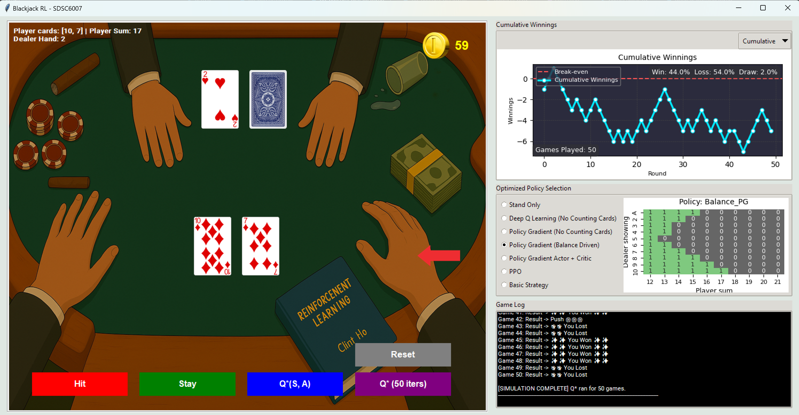

# SDSC-6007
SDSC 6007 - Reinforcement Learning

## How to use

install everything in ./game/requirements.txt
```
# if your windows 
python3 -m venv env 
cd ../env/Scripts
activate 
cd ../../game

# if linux
python3 -m venv env
source ./env/Scripts/activate


# launch game
cd ./game
pip install -r ./game/requirements.txt
python ./game/ui.pyw
```


## Screenshots

